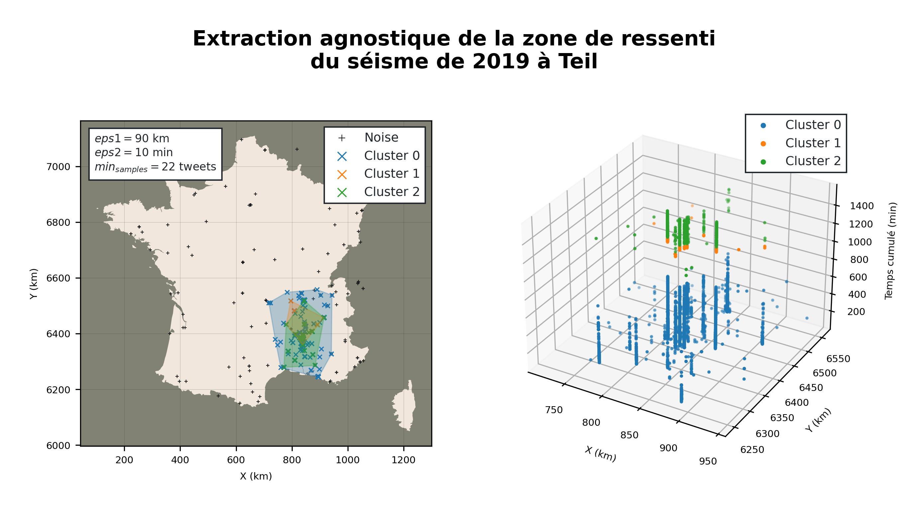

# Agnostic Extraction af Quake's Active Area

<p align='center'>
    
</p>

## Context

This project is part of a course issued at the ENSG-Géomatique school, it was proposed to us by [BRGM](https://www.brgm.fr/en) in order to identify a quake's active area once we retrieved tweets related to a seismic activity.

As a case study, we worked on the 2019 Teil Quake by testing different clustering algorithms to find the most active areas. Since tweets have a temporal dimension, we decided to use a spatial temporal clustering algorithm. In our case we used [ST-DBSCAN](https://github.com/eren-ck/st_dbscan).

## Setup

To run the ST-DBSCAN Jupyter Notebook, you'll need to setup a conda environment. To do so, run the following command in your terminal:

```bash
conda env create -f environment.yml
```

You'll find the **ST-DBSCAN** Jupyter Notebook in the `notebooks` folder.

## Analysis

In order to prepare the tweets for the clustering, we followed these steps:

- We used `.hdf` format to store the tweets.
- We removed tweets that were not in the area of interest (in this case **France**).
- We removed tweets with no coordinates.
- We ordered tweets by datetime and calculated a cumulative timestamp.

For us to choose the optimal parameters for ST-DBSCAN, we iterated over the minimum number of tweets and the maximum distance for an interval of time of 10 minutes. The results were as follows:

<p align='center'>
    
</p>

## Results

We adopted the following parameters:

| eps1 (distance) | eps2 (time) |  MinPts (tweets)  |
| --------------- | ----------- | --------- |
|      90 km      |    10 min   | 22 tweets |

The clustering took 1.62 s for a total of 5 clusters.

| Time (s) |  # of clusters  |
| ----------- | --------- |
|    1.62   | 5 |

We use ThreeJS to visualize the results. Visit [this link](https://lletassey.github.io/clustering-tweets-earthquake/threejs/index.html).

<p align='center'>
    
</p>

> Made with ♥ by Léa, Romain and Salaheddine. 