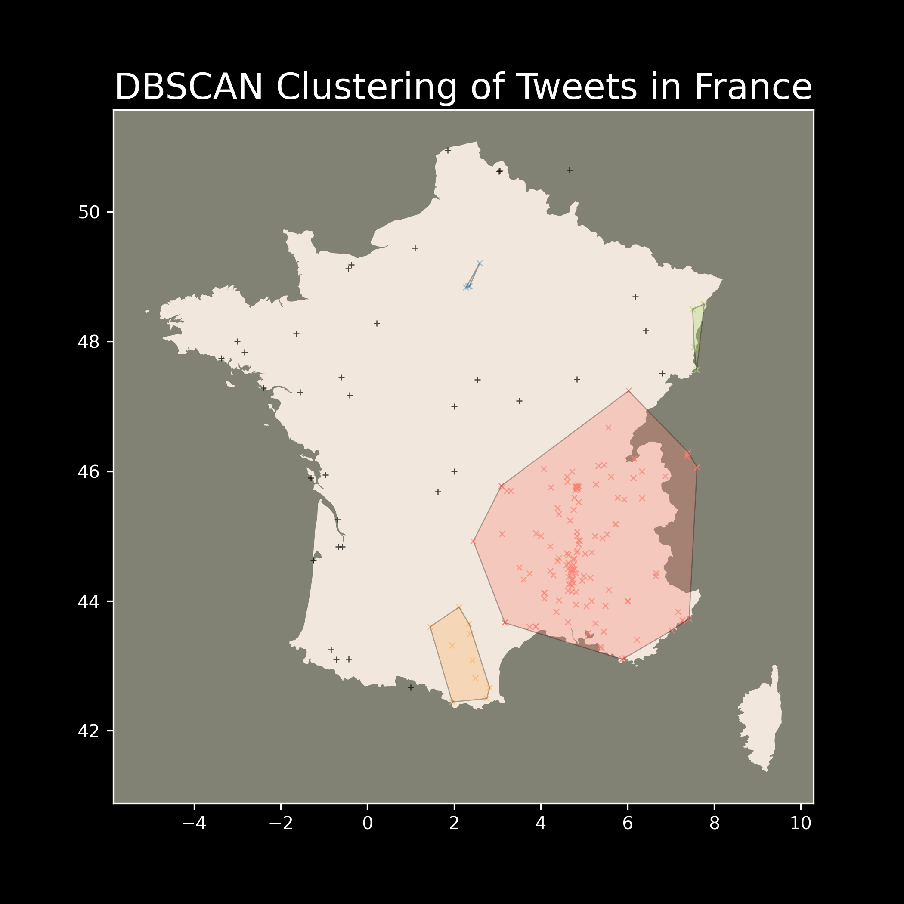

# Clustering Teil Quake Tweets

<p align='center'>
    
</p>

Spatial temporal clustering of Teil Quake Tweets.

## Getting Started

### Prerequisites

To run jupyter notebooks you need to setup a conda environment. To do so, run the following command:

```bash
conda env create -f environment.yml
```
