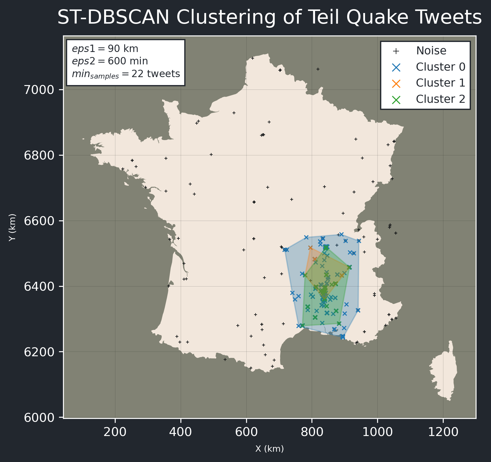
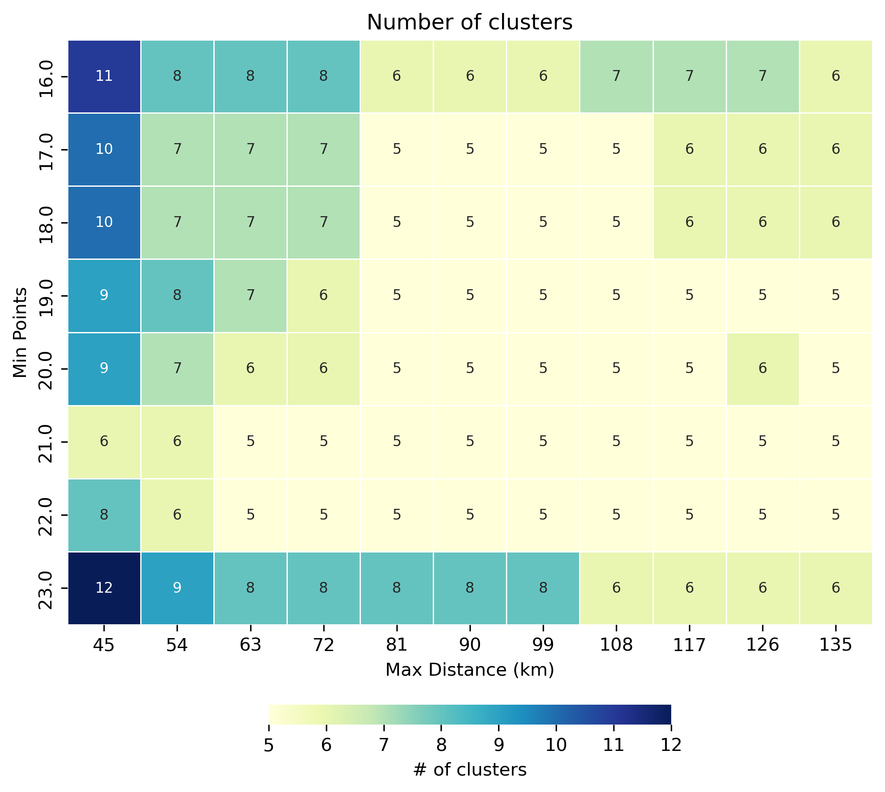
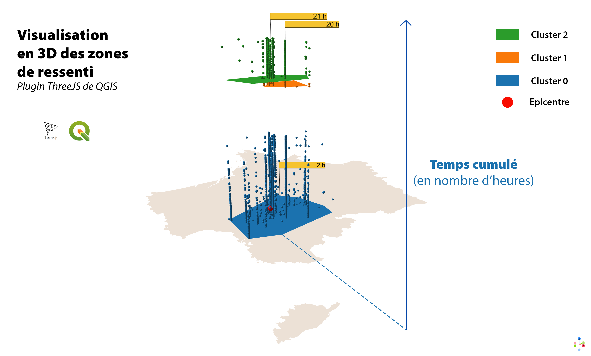

# Spatial Temporal Clustering of 2019 Teil Quake Tweets

<p align='center'>
    
</p>

## Setup

To run the ST-DBSCAN Jupyter Notebook, you'll need to setup a conda environment. To do so, run the following command in your terminal:

```bash
conda env create -f environment.yml
```

You'll find the ST-DBSCAN Jupyter Notebook in the `notebooks` folder.

## Context

This project is part of a course issued at the ENSG-Géomatique school, it was proposed to us by [BRGM](https://www.brgm.fr/en). They use Twitter API to automatically retrieve tweets related to quake events.

The goal of our project was to cluster tweets about the 2019 Teil Quake in order to find the most active areas. Since tweets have a temporal dimension, we decided to use a spatial temporal clustering algorithm. In our case we used [ST-DBSCAN](https://github.com/eren-ck/st_dbscan).

## Analysis

In order to prepare the tweets for the clustering, we followed these steps:

- We used hdf format to store the tweets.
- We removed tweets that were not in the area of interest (in this case France).
- We removed tweets with no coordinates.
- We ordered tweets by datetime and calculated a cumulative timestamp.

For us to choose the optimal parameters for ST-DBSCAN, we iterated over the minimum number of tweets and the maximum distance for an interval of time of 10 minutes. The results were as follows:

<p align='center'>
    
</p>

## Results

We adopted the following parameters: `eps1 = 90 km` and `eps2 = 10 min` and a minimum number of tweets of 22. We used ThreeJS to plot cluster hulls. Visit [this link](https://lletassey.github.io/clustering-tweets-earthquake/threejs/index.html) to see the result.

<p align='center'>
    
</p>

> Made with ♥ by Léa, Romain and Salaheddine. 