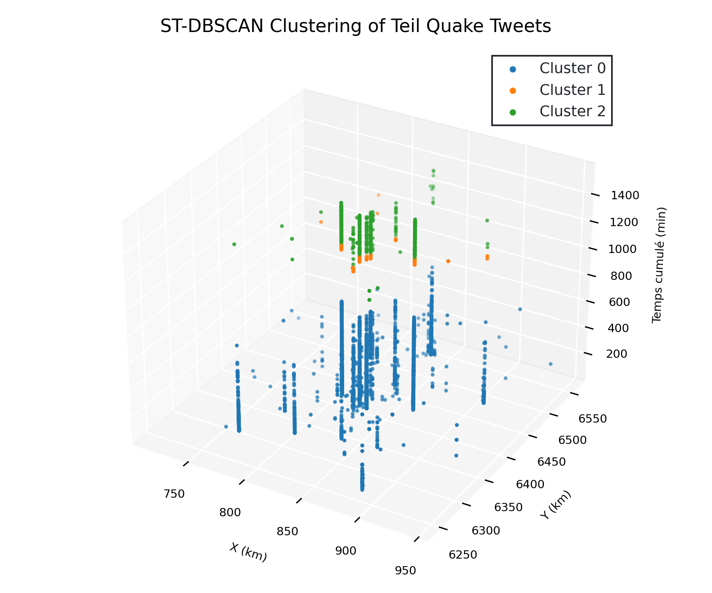

# Spatial Temporal Clustering of 2019 Teil Quake Tweets

<p align='center'>
    
</p>

## Getting Started

### Prerequisites

To run jupyter notebooks you need to setup a conda environment. To do so, run the following command:

```bash
conda env create -f environment.yml
```

### 3D Plotting

<p align='center'>
    
</p>

We use ThreeJS to plot hulls. Visit [this link](https://lletassey.github.io/clustering-tweets-earthquake/threejs/index.html).

<p align='center'>
    
</p>

## Parameters

We test the optimal parameters for ST-DBSCAN.

<p align='center'>
    
</p>

> Made with ♥ by Léa, Romain and Salaheddine. 